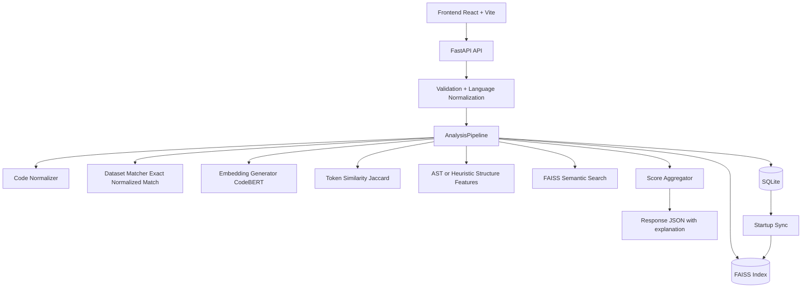

# AI Code Plagiarism Detector

Multi-signal code similarity analysis platform using FastAPI, CodeBERT, FAISS, SQLite, and a React frontend.

## 1. Project Summary

This system evaluates similarity using layered signals instead of plain text matching:

- Semantic similarity from transformer embeddings (CodeBERT)
- Token overlap via Jaccard similarity
- Structural similarity via AST (Python) and heuristic extraction (non-Python)
- Exact normalized corpus matching for known samples

The output includes:

- plagiarism_percentage
- ai_probability
- confidence
- explanation payload (signal values, reasoning, highlights, metrics)

## 2. System Ends

- Frontend: file/code submission, result visualization, export
- Backend API: validation, orchestration, response shaping
- Similarity Engine: normalization + feature extraction + vector search + scoring
- Persistence: SQLite for records, FAISS for runtime nearest-neighbor search
- Runtime: local mode and Docker mode with persistent mounts

## 3. High-Level Architecture



## 4. Workspace Structure

```text
ai-code-plagiarism-detector/
|-- src/
|   |-- api/
|   |-- models/
|   |-- pipeline/
|   |-- storage/
|   `-- utils/
|-- frontend/
|   `-- src/
|-- scripts/
|-- configs/
|-- data/
|   |-- raw/
|   |-- embeddings/
|   |-- processed/
|   `-- results/
|-- docker/
|-- tests/
|-- docker-compose.yml
`-- requirements.txt
```

## 5. Processing Pipeline

### 5.1 Startup pipeline

1. FastAPI starts and builds shared dependencies.
2. Analysis pipeline is initialized.
3. FAISS/DB synchronization runs:
     - If cached FAISS metadata matches DB embedding count, cache is loaded.
     - Otherwise FAISS is rebuilt from DB embeddings and cache is refreshed.

### 5.2 Request pipeline

1. Validate request and normalize language.
2. Normalize code for canonical comparison.
3. Try exact normalized corpus match.
4. If no exact match:
     - create embedding
     - run FAISS semantic retrieval
     - compute token and structure similarity against stored records
5. Aggregate scores and confidence.
6. Return explanation payload.
7. Persist result and incrementally update FAISS cache.

## 6. API Reference

- POST /analyze/
    Description: analyze JSON payload with code and optional language.

- POST /analyze/file
    Description: analyze a single uploaded file.

- POST /analyze/files
    Description: analyze a batch of uploaded files.

- GET /health
    Description: service health check.

Supported extensions:

- .py, .java, .js, .jsx, .ts, .tsx, .cpp, .c, .go, .rs

## 7. Scoring Model and Interpretation

Final outputs:

- plagiarism_percentage: overlap-oriented similarity estimate
- ai_probability: AI-style pattern estimate
- confidence: low/medium/high confidence band

Interpretation notes:

- Exact corpus matches can drive high plagiarism scores.
- ai_probability is conservative for short/low-agreement code.
- Size penalties and damping are intentionally applied to reduce overconfident false positives.
- ai_probability is normalized to configured AI weight totals for better score-range representation.

## 8. FAISS and DB Synchronization Model

The system maintains balance between persistent storage and vector index state:

- SQLite stores canonical analysis records and serialized embeddings.
- FAISS stores normalized embedding vectors for fast nearest-neighbor retrieval.
- Startup sync checks DB embedding count against cached FAISS metadata.
- Request-time insert path updates DB first, then FAISS, then persists FAISS cache metadata.

This design ensures runtime speed while preserving reproducibility across restarts.

## 9. Local Setup

### Backend

```bash
python -m venv venv
# Windows
venv\Scripts\activate
# Linux/macOS
source venv/bin/activate

pip install -r requirements.txt
python scripts/init_db.py
uvicorn src.api.main:app --host 127.0.0.1 --port 8000 --reload
```

### Frontend

```bash
cd frontend
npm install
```

Create frontend/.env.local:

```env
VITE_API_BASE_URL=http://127.0.0.1:8000
```

Run frontend:

```bash
npm run dev
```

Default endpoints:

- API: http://127.0.0.1:8000
- API Docs: http://127.0.0.1:8000/docs
- Frontend: http://127.0.0.1:3000

## 10. Docker Setup

Build and run:

```bash
docker compose build
docker compose up -d
```

Service endpoints:

- Backend: http://localhost:8000
- Frontend: http://localhost:3000

Persistent runtime mounts:

- runtime/db -> SQLite DB
- runtime/data -> raw corpus and FAISS cache files
- runtime/hf_cache -> Hugging Face cache

## 11. Data Operations and Evaluation

### Incremental dataset load

```bash
python scripts/load_datasets.py --source auto
```

Variants:

```bash
python scripts/load_datasets.py --source filesystem
python scripts/load_datasets.py --source csv --csv-path data/results/evaluation_results.csv
python scripts/load_datasets.py --source filesystem --rebuild-faiss
```

### Sanity and index checks

```bash
python scripts/sanity_check.py
python scripts/build_faiss_index.py
```

### Evaluation workflow

```bash
python scripts/evaluate_dataset.py
python scripts/plot_results.py
```

Outputs are generated under data/results and assets.

## 12. Frontend Feature Surface

- Single and batch analysis
- Result cards and signal metrics panel
- Source-code highlight overlays
- Export support (JSON, CSV, print)

## 13. Practical Usage Scope

Suitable for:

- Similarity triage
- Pattern exploration
- Reviewer-assist workflows

Not designed as:

- standalone legal decision engine
- direct disciplinary automation

## 14. Tracking Section (Legacy-Style Reference)

### Fresh reset (clean start)

```powershell
Remove-Item .\runtime\db\plagiarism.db -Force -ErrorAction SilentlyContinue
Remove-Item .\runtime\data\embeddings\faiss.index -Force -ErrorAction SilentlyContinue
Remove-Item .\runtime\data\embeddings\faiss.meta.json -Force -ErrorAction SilentlyContinue
python scripts/init_db.py
uvicorn src.api.main:app --host 127.0.0.1 --port 8000 --reload
```

### Current status

- Backend API, similarity pipeline, persistence, and FAISS sync are integrated.
- Frontend analysis and export flow is integrated.
- Incremental dataset ingestion and evaluation tooling are available.

Last updated: April 1, 2026
