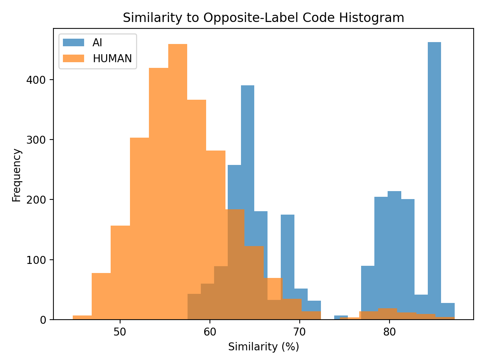

# 🚀 AI Code Plagiarism Detection System

> 🔍 *A production-grade similarity engine for source code using semantic embeddings, AST analysis, and FAISS vector search*

[](https://www.python.org/)
[](https://fastapi.tiangolo.com/)
[](LICENSE)

---

## 📋 Table of Contents

- [Overview](#-overview)
- [System Architecture](#-system-architecture)
- [Key Features](#-key-features)
- [Tech Stack](#-tech-stack)
- [Project Structure](#-project-structure)
- [Installation](#-installation)
- [Usage](#-usage)
- [API Endpoints](#-api-endpoints)
- [Configuration](#-configuration)
- [Dataset & Evaluation](#-dataset--evaluation)
- [Pipeline Components](#-pipeline-components)
- [How It Works](#-how-it-works)
- [Supported Languages](#-supported-languages)
- [Key Learnings](#-key-learnings)
- [Future Enhancements](#-future-enhancements)
- [Disclaimer](#%EF%B8%8F-disclaimer)
- [Project Status](#-project-status)

---

## ✨ Overview

This project implements a **production-ready code plagiarism detection system** that uses **multi-signal similarity analysis** instead of simple text matching or AI classification. The system answers the question:

> **"How similar is this code to existing code in our database?"**

This approach mirrors real-world plagiarism detection systems used in academia and enterprise environments (Turnitin, MOSS, Codequiry).

### What This System Does

Instead of asking *"Was this written by AI?"*, it performs:

* ✅ **Multi-dimensional similarity analysis** (semantic + structural + token-based)
* ✅ **Vector-based search** using FAISS for fast retrieval
* ✅ **Explainable scoring** with confidence metrics
* ✅ **Language-agnostic analysis** supporting 8+ programming languages
* ✅ **Batch processing** with detailed validation and error reporting

---

## 🏗️ System Architecture

```
┌─────────────────────────────────────────────────────────────────┐
│                        FastAPI Application                       │
│  ┌───────────┐  ┌─────────────┐  ┌──────────────────────────┐  │
│  │  /analyze │  │ /analyze/file│  │  /analyze/files (batch)  │  │
│  └─────┬─────┘  └──────┬──────┘  └───────────┬──────────────┘  │
└────────┼────────────────┼─────────────────────┼─────────────────┘
         │                │                     │
         └────────────────┴─────────────────────┘
                          │
                   ┌──────▼──────┐
                   │  Validation │
                   │   & Metrics │
                   └──────┬──────┘
                          │
                   ┌──────▼──────────┐
                   │ Analysis Pipeline│
                   └──────┬──────────┘
                          │
         ┌────────────────┼────────────────┐
         │                │                │
   ┌─────▼──────┐  ┌─────▼──────┐  ┌─────▼─────┐
   │Normalizer  │  │AST Analyzer│  │  Embedding │
   │            │  │            │  │  Generator │
   └─────┬──────┘  └─────┬──────┘  └─────┬─────┘
         │                │                │
         └────────────────┴────────────────┘
                          │
         ┌────────────────┼────────────────┐
         │                │                │
   ┌─────▼──────┐  ┌─────▼──────┐  ┌─────▼──────┐
   │   Token    │  │  Structure │  │  Semantic  │
   │ Similarity │  │ Similarity │  │ Similarity │
   └─────┬──────┘  └─────┬──────┘  └─────┬──────┘
         │                │                │
         └────────────────┴────────────────┘
                          │
                   ┌──────▼──────┐
                   │    Score    │
                   │  Aggregator │
                   └──────┬──────┘
                          │
         ┌────────────────┴────────────────┐
         │                                  │
   ┌─────▼─────┐                    ┌──────▼──────┐
   │  SQLite   │◄──── Sync ────────►│    FAISS    │
   │ Database  │                    │    Index    │
   └───────────┘                    └─────────────┘
```

---

## 🎯 Key Features

### Core Functionality
- **Multi-Signal Analysis**: Combines semantic, token-based, and structural similarity
- **FAISS Vector Search**: Fast cosine similarity search using CodeBERT embeddings
- **Persistent Storage**: SQLite database with automatic FAISS synchronization
- **Configurable Scoring**: YAML-based threshold and weight configuration
- **Confidence Metrics**: Multi-level confidence scoring (high/medium/low)

### API Features
- **RESTful API**: Production-ready FastAPI with OpenAPI documentation
- **Multiple Endpoints**: Single code, file upload, and batch processing
- **Robust Validation**: File size, type, encoding, and content validation
- **Batch Processing**: Upload up to 25 files simultaneously
- **Error Handling**: Detailed error messages with partial success support

### Code Analysis
- **Multi-Language Support**: Python, Java, JavaScript, TypeScript, C, C++, Go, Rust
- **AST-Based Analysis**: Language-specific parsing with fallback heuristics
- **Smart Normalization**: Comment removal, whitespace handling, case normalization
- **Size Penalties**: Fair scoring for small code snippets

### Explainability
- **Detailed Explanations**: Breakdown of all similarity signals
- **Code Highlights**: Line-by-line annotations for key features
- **Signal Bands**: High/medium/low categorization of each metric
- **Reasoning**: Natural language explanation of scoring decisions

---

## 🛠️ Tech Stack

| Category | Technologies |
|----------|-------------|
| **Backend** | FastAPI, Uvicorn, Pydantic |
| **ML/AI** | PyTorch, HuggingFace Transformers, CodeBERT |
| **Vector Search** | FAISS (Facebook AI Similarity Search) |
| **Database** | SQLAlchemy, SQLite |
| **Code Analysis** | Python AST, asttokens |
| **Utilities** | PyYAML, NumPy |
| **Evaluation** | Pandas, Matplotlib |

---

## 📂 Project Structure

```
ai-code-plagiarism-detector/
│
├── src/
│   ├── api/                       # FastAPI application
│   │   ├── main.py               # App initialization & lifespan
│   │   ├── routes.py             # API endpoints (/analyze, /file, /files)
│   │   ├── schemas.py            # Pydantic models (request/response)
│   │   ├── dependencies.py       # Dependency injection & FAISS sync
│   │   └── file_validation.py    # File validation & language detection
│   │
│   ├── pipeline/                  # Analysis pipeline
│   │   ├── orchestrator.py       # Main pipeline orchestrator
│   │   ├── normalizer.py         # Code normalization
│   │   ├── ast_analyzer.py       # AST feature extraction
│   │   ├── token_similarity.py   # Jaccard token similarity
│   │   ├── embedding.py          # CodeBERT embedding generation
│   │   ├── faiss_search.py       # FAISS similarity search
│   │   └── scorer.py             # Score aggregation & confidence
│   │
│   ├── models/                    # ML models
│   │   ├── codebert.py           # CodeBERT model wrapper
│   │   └── tokenizer.py          # (Future) Custom tokenizers
│   │
│   ├── storage/                   # Data persistence
│   │   ├── db.py                 # SQLAlchemy configuration
│   │   ├── models.py             # Database models
│   │   ├── repository.py         # Data access layer
│   │   └── faiss_index.py        # FAISS index management
│   │
│   └── utils/                     # Utilities
│       ├── config.py             # YAML config loading
│       ├── hashing.py            # Code hashing utilities
│       ├── logging.py            # Logging configuration
│       └── language_detect.py    # Language detection
│
├── scripts/                       # Offline evaluation & utilities
│   ├── evaluate_dataset.py       # Batch dataset evaluation
│   ├── analyze_results.py        # Results analysis
│   ├── plot_results.py           # Visualization generation
│   ├── build_faiss_index.py      # FAISS index builder
│   ├── init_db.py                # Database initialization
│   ├── load_datasets.py          # Dataset loading utilities
│   └── sanity_check.py           # System health checks
│
├── configs/                       # Configuration files
│   ├── settings.yaml             # API settings
│   └── thresholds.yaml           # Scoring thresholds & weights
│
├── data/
│   ├── raw/
│   │   ├── ai/chatgpt/           # 127+ AI-generated samples
│   │   └── human/leetcode/       # 400+ LeetCode solutions
│   ├── processed/                # Processed datasets
│   ├── embeddings/               # Pre-computed embeddings
│   └── results/                  # Evaluation results
│
├── assets/                        # Visualizations & documentation
│   ├── plagiarism_boxplot.png
│   ├── plagiarism_histogram.png
│   └── ai_probability_boxplot.png
│
├── tests/                         # Unit & integration tests
│   ├── test_ast.py
│   ├── test_normalizer.py
│   ├── test_pipeline.py
│   └── test_similarity.py
│
├── requirements.txt               # Python dependencies
├── README.md
└── plagiarism.db                 # SQLite database (runtime)
```

---

## ⚙️ Installation

### Prerequisites

- Python 3.9 or higher
- pip (Python package manager)
- 4GB+ RAM (for CodeBERT model)

### Step 1: Clone the Repository

```bash
git clone https://github.com/LavanuruRohithRoy/ai-code-plagiarism-detector.git
cd ai-code-plagiarism-detector
```

### Step 2: Create Virtual Environment

```bash
python -m venv venv

# Windows
venv\Scripts\activate

# Linux/macOS
source venv/bin/activate
```

### Step 3: Install Dependencies

```bash
pip install -r requirements.txt
```

This will install:
- FastAPI & Uvicorn (API framework)
- PyTorch & Transformers (CodeBERT)
- FAISS-CPU (vector search)
- SQLAlchemy (database ORM)
- Other utilities (PyYAML, NumPy, etc.)

### Step 4: Initialize Database

```bash
python scripts/init_db.py
```

---

## 🚀 Usage

### Start the API Server

```bash
uvicorn src.api.main:app --reload
```

Server will start at `http://localhost:8000`

- **API Documentation**: `http://localhost:8000/docs`
- **Alternative Docs**: `http://localhost:8000/redoc`
- **Health Check**: `http://localhost:8000/health`

### Using the API

#### 1. Analyze Code (JSON)

```bash
curl -X POST "http://localhost:8000/analyze/" \
  -H "Content-Type: application/json" \
  -d '{
    "code": "def fibonacci(n):\n    if n <= 1:\n        return n\n    return fibonacci(n-1) + fibonacci(n-2)",
    "language": "python"
  }'
```

#### 2. Analyze Single File

```bash
curl -X POST "http://localhost:8000/analyze/file" \
  -F "file=@solution.py"
```

#### 3. Batch Analysis (Multiple Files)

```bash
curl -X POST "http://localhost:8000/analyze/files" \
  -F "files=@file1.py" \
  -F "files=@file2.js" \
  -F "files=@file3.java"
```

---

## 📡 API Endpoints

### `POST /analyze/`

Analyze code sent as JSON.

**Request Body:**
```json
{
  "code": "string (required, max 50000 chars)",
  "language": "string (optional, defaults to python)"
}
```

**Response:**
```json
{
  "plagiarism_percentage": 45.67,
  "ai_probability": 52.34,
  "confidence": "medium",
  "explanation": {
    "token_similarity": 0.42,
    "semantic_similarity": 0.58,
    "structure_similarity": 0.51,
    "code_lines": 12,
    "size_penalty_applied": false,
    "db_inserted": true,
    "language": "python",
    "metrics": { ... },
    "signal_bands": {
      "token": "medium",
      "semantic": "medium",
      "structure": "medium"
    },
    "highlights": [ ... ],
    "reasoning": "Similarity based on semantic, token, and structural overlap."
  }
}
```

### `POST /analyze/file`

Upload and analyze a single file.

**Form Data:**
- `file`: Code file (max 200KB)

**Supported Extensions:** `.py`, `.java`, `.js`, `.ts`, `.cpp`, `.c`, `.go`, `.rs`

### `POST /analyze/files`

Batch analysis of multiple files (max 25 files).

**Response:**
```json
{
  "total_files": 3,
  "succeeded": 2,
  "failed": 1,
  "results": [ ... ],
  "errors": {
    "invalid_file.txt": "Unsupported file extension '.txt'"
  }
}
```

### `GET /health`

Health check endpoint.

**Response:**
```json
{
  "status": "ok"
}
```

---

## ⚙️ Configuration

### `configs/settings.yaml`

API-level settings:

```yaml
docs_url: "/docs"           # OpenAPI documentation URL
redoc_url: "/redoc"         # ReDoc documentation URL
openapi_url: "/openapi.json" # OpenAPI schema URL
```

### `configs/thresholds.yaml`

Scoring weights and confidence thresholds:

```yaml
# Plagiarism score weights
plagiarism_semantic_weight: 0.4
plagiarism_token_weight: 0.3
plagiarism_structure_weight: 0.3

# AI probability weights
ai_semantic_weight: 0.6
ai_structure_weight: 0.4

# Confidence thresholds
high_confidence_min_similarity: 0.8
high_confidence_max_spread: 0.2
high_confidence_min_lines: 12

medium_confidence_min_similarity: 0.5
medium_confidence_min_lines: 6

low_confidence_max_lines: 4
```

---

## 🧪 Dataset & Evaluation

### Dataset Composition

| Category | Source | Count | Description |
|----------|--------|-------|-------------|
| **Human Code** | LeetCode Solutions | 400+ | Competitive programming solutions in Python |
| **AI Code** | ChatGPT | 127+ | AI-generated Python programs |

### Running Evaluation

```bash
# Evaluate entire dataset
python scripts/evaluate_dataset.py

# Generate visualizations
python scripts/plot_results.py

# Analyze results
python scripts/analyze_results.py
```

### Evaluation Results

#### Plagiarism Score Distribution


**Key Insights:**
- Human code shows **higher similarity** due to standardized algorithmic patterns
- AI-generated code clusters around **lower similarity values**
- System correctly differentiates between known patterns and novel code

#### AI Probability Distribution


**Key Insights:**
- AI probability reflects **pattern confidence**, not authorship detection
- Human solutions exhibit higher variance due to diverse coding styles
- Metric is complementary to plagiarism score

#### Plagiarism Histogram



**Key Insights:**
- Clear separation between established patterns and unique code
- Behavior aligns with real-world plagiarism detection systems
- No false binary classification—continuous similarity spectrum

---

## 🔧 Pipeline Components

### 1. Code Normalizer (`normalizer.py`)

**Purpose:** Standardize code for consistent comparison

**Operations:**
- Case normalization
- Comment removal (preserving structure)
- Whitespace normalization
- Consistent indentation

### 2. AST Analyzer (`ast_analyzer.py`)

**Purpose:** Extract structural features from code

**Features Extracted:**
- Number of functions/classes
- Loop count (for, while)
- Conditional count (if, else)
- Maximum nesting depth

**Fallback:** Language-agnostic heuristics for non-Python code

### 3. Token Similarity (`token_similarity.py`)

**Purpose:** Compute token-level overlap

**Method:** Jaccard similarity on tokenized code
- Extracts identifiers, keywords, operators
- Computes set intersection/union
- Returns similarity ratio [0.0, 1.0]

### 4. Embedding Generator (`embedding.py`)

**Purpose:** Generate semantic code embeddings

**Model:** Microsoft CodeBERT (`microsoft/codebert-base`)
- Pre-trained on 6+ programming languages
- Mean pooling over token embeddings
- 768-dimensional vector output

### 5. FAISS Search (`faiss_search.py`)

**Purpose:** Fast vector similarity search

**Implementation:**
- Cosine similarity using L2-normalized vectors
- Returns top-1 similarity score
- In-memory index with persistent sync

### 6. Score Aggregator (`scorer.py`)

**Purpose:** Combine signals into final scores

**Calculations:**
- **Plagiarism Score:** Weighted combination of token, semantic, and structure similarity
- **AI Probability:** Weighted combination of semantic and structure signals
- **Confidence:** Based on agreement between signals and code size

---

## 🔍 How It Works

### Analysis Flow

1. **Input Validation**
   - Check file size, encoding, language support
   - Compute basic metrics (lines, characters, tokens)

2. **Normalization**
   - Remove comments preserving structure
   - Normalize whitespace and case
   - Standardize formatting

3. **Feature Extraction**
   - Parse AST (Python) or use heuristics (other languages)
   - Extract structural features
   - Generate CodeBERT embedding

4. **Similarity Computation**
   - **Semantic:** FAISS cosine similarity with database
   - **Token:** Jaccard similarity with all stored code
   - **Structure:** AST feature distance

5. **Score Aggregation**
   - Combine signals using configured weights
   - Apply size penalties for small snippets
   - Compute confidence based on signal agreement

6. **Storage & Response**
   - Save to SQLite (if new code)
   - Update FAISS index
   - Return detailed explanation with highlights

---

## 🌐 Supported Languages

| Language | Extension | AST Analysis | Heuristic Fallback |
|----------|-----------|--------------|-------------------|
| Python | `.py` | ✅ Full | ✅ |
| Java | `.java` | ⚠️ Heuristic | ✅ |
| JavaScript | `.js` | ⚠️ Heuristic | ✅ |
| TypeScript | `.ts` | ⚠️ Heuristic | ✅ |
| C | `.c` | ⚠️ Heuristic | ✅ |
| C++ | `.cpp` | ⚠️ Heuristic | ✅ |
| Go | `.go` | ⚠️ Heuristic | ✅ |
| Rust | `.rs` | ⚠️ Heuristic | ✅ |

**Note:** All languages use semantic embeddings (CodeBERT). Python has full AST support; others use language-agnostic structural heuristics.

---

## 📌 Key Learnings

### Technical Insights

1. **Similarity ≠ Classification**
   - System measures **reuse patterns**, not authorship
   - Continuous scores provide more nuance than binary labels
   - Dataset imbalance doesn't bias similarity engines

2. **Multi-Signal Robustness**
   - Single metrics can be fooled (e.g., variable renaming)
   - Combining token, semantic, and structural signals improves accuracy
   - Weighted aggregation allows domain-specific tuning

3. **Production Considerations**
   - FAISS-SQLite synchronization critical for consistency
   - Lifespan management ensures index rebuilds on restart
   - Validation layers prevent malformed inputs from crashing pipeline

4. **Explainability Matters**
   - Raw scores insufficient for user trust
   - Detailed breakdowns aid debugging and transparency
   - Confidence metrics guide interpretation

### Engineering Best Practices

- **Modular Pipeline**: Each component independently testable
- **Dependency Injection**: Facilitates testing and configuration
- **Configuration-Driven**: YAML configs for easy tuning
- **Graceful Degradation**: Fallback heuristics for unsupported languages
- **Comprehensive Validation**: Multi-layer input sanitization

---

## 🔮 Future Enhancements

### Planned Features

- [ ] **Advanced Explainability**
  - Visual diff highlighting similar code sections
  - Line-by-line contribution to similarity score
  - Similar code snippet retrieval

- [ ] **Performance Optimizations**
  - GPU support for faster embedding generation
  - Batch embedding generation
  - FAISS index sharding for large datasets

- [ ] **Enhanced Language Support**
  - Language-specific AST parsers (Tree-sitter)
  - Support for more languages (Ruby, PHP, Swift, Kotlin)
  - Multi-file project analysis

- [ ] **Advanced Features**
  - Plagiarism report generation (PDF)
  - Temporal analysis (code evolution tracking)
  - GitHub integration for repository scanning
  - Custom model fine-tuning on domain-specific code

- [ ] **Frontend Development**
  - React-based web UI
  - Real-time analysis progress
  - Interactive result visualization
  - User authentication & project management

### Research Directions

- Investigating transformer models specialized for code (GraphCodeBERT, CodeT5)
- Cross-language plagiarism detection
- Automated refactoring detection
- Integration with CI/CD pipelines

---

## ⚠️ Disclaimer

**Important:** This system is designed for **similarity analysis**, not authorship verification.

- **High plagiarism scores** indicate code reuse patterns, not necessarily misconduct
- **AI probability** reflects pattern confidence, not whether AI wrote the code
- Use as a **supplementary tool** alongside manual code review
- Results should be interpreted in **context** (e.g., standard algorithms will show high similarity)

This tool is intended for:
- ✅ Educational settings (academic integrity checks)
- ✅ Code review assistance
- ✅ Duplicate code detection
- ✅ Codebase health monitoring

---

## 📊 Project Status

### ✅ Completed Features

- [x] Full FastAPI backend with multiple endpoints
- [x] Multi-language support (8 languages)
- [x] CodeBERT semantic embeddings
- [x] FAISS vector search integration
- [x] SQLite database with automatic sync
- [x] AST-based structural analysis
- [x] Token similarity engine
- [x] Configurable scoring system
- [x] Batch file processing
- [x] Comprehensive validation & error handling
- [x] Detailed explanations with code highlights
- [x] Confidence scoring
- [x] Size-based penalty system
- [x] Offline evaluation pipeline
- [x] Dataset collection (400+ human + 127+ AI samples)
- [x] Visualization generation

### 🚧 In Progress

- [ ] Frontend web interface
- [ ] Advanced visualization dashboards
- [ ] Performance benchmarking

### 📅 Roadmap

**Q2 2026:**
- Complete frontend development
- GPU acceleration support
- Extended language support (Tree-sitter)

**Q3 2026:**
- GitHub integration
- CI/CD pipeline support
- Custom model fine-tuning

**Q4 2026:**
- Enterprise deployment guides
- Containerization (Docker)
- Kubernetes orchestration

---

**Status:** ✨ **Production-Ready Core** | 🚀 **Actively Developed**

Last Updated: March 7, 2026
