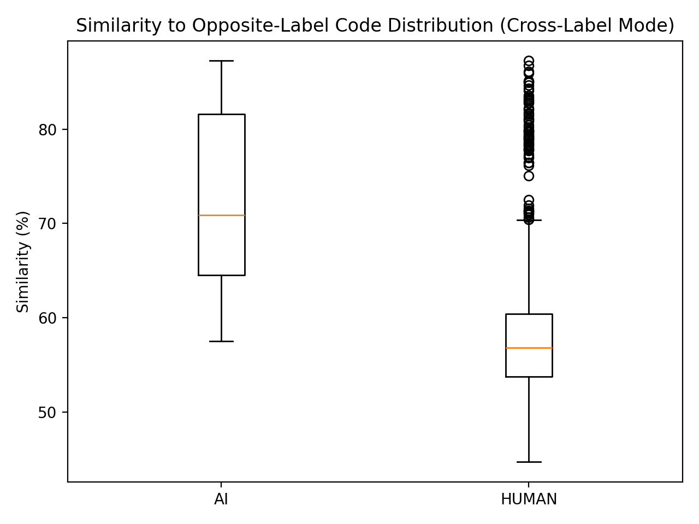
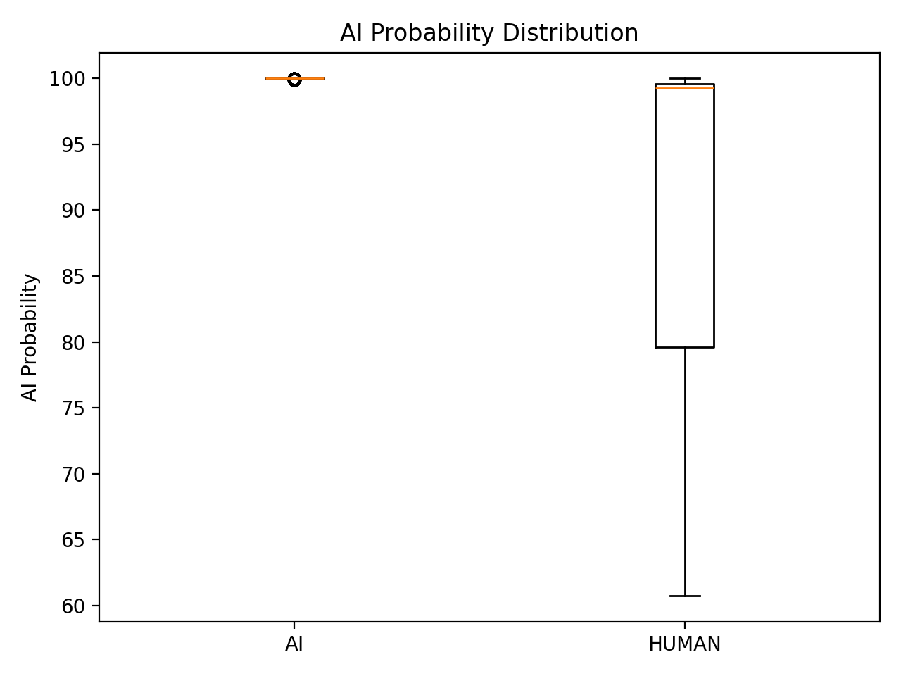
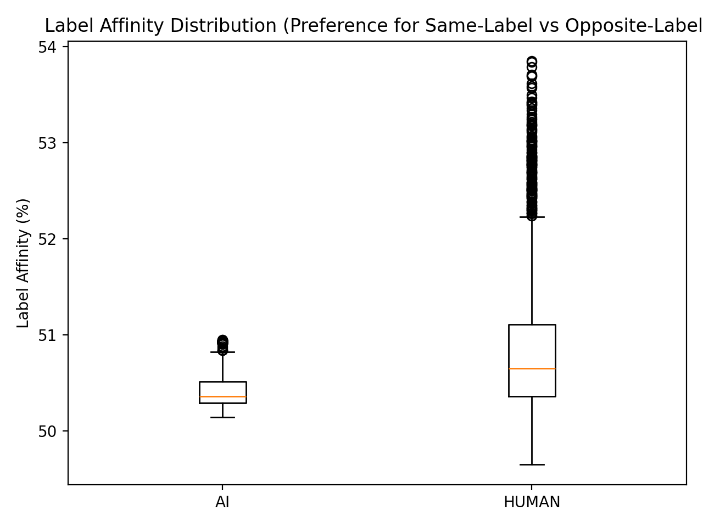
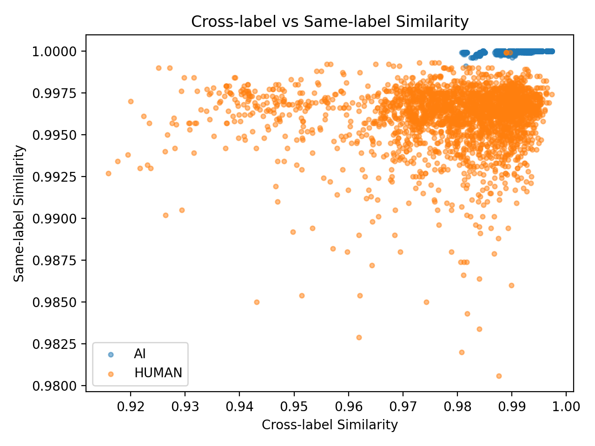

# 🚀 AI Code Plagiarism Detector

> Multi-signal code similarity analysis with FastAPI, CodeBERT, FAISS, SQLite, and a React frontend.

[](https://www.python.org/)
[](https://fastapi.tiangolo.com/)
[](https://vitejs.dev/)

---

## ✨ Overview

This system analyzes code using **multiple independent signals** instead of plain string matching:
- **Semantic similarity** (CodeBERT embeddings + FAISS nearest-neighbor search)
- **Token overlap** (Jaccard similarity)
- **Structural similarity** (AST features / heuristic structure features)
- **Exact corpus match** (normalized hash lookup over dataset files)

The output is a weighted similarity interpretation (`plagiarism_percentage`, `ai_probability`, `confidence`) with explainable details, source code rendering, and highlights.

---

## 🧠 How the System Works

### 1) Startup flow
When backend starts:
1. FastAPI app initializes.
2. Shared pipeline is created (normalizer, AST, token sim, embedder, scorer, dataset matcher).
3. FAISS sync runs:
   - If cached FAISS index metadata matches DB embedding count, load cache quickly.
   - Else rebuild FAISS from SQLite embeddings and refresh cache.

### 2) Request flow (`/analyze`, `/analyze/file`, `/analyze/files`)
1. Validate code/file + detect language.
2. Normalize code.
3. Exact normalized hash match against dataset corpus (`data/raw`).
4. If no exact match:
   - compute embedding,
   - semantic similarity from FAISS,
   - token + structural similarity from stored records.
5. Aggregate scores + confidence.
6. Return explanation payload with metrics, highlights, legend, and reasoning.
7. Persist new record to SQLite and keep FAISS consistent.

---

## 🏗️ Architecture (High Level)

```text
Client (React)
   │
   ▼
FastAPI API layer (validation, routing)
   │
   ▼
AnalysisPipeline
   ├─ Normalizer
   ├─ DatasetMatcher (exact normalized hash)
   ├─ EmbeddingGenerator (CodeBERT)
   ├─ TokenSimilarity
   ├─ StructureFeatures / AST
   └─ ScoreAggregator
   │
   ├─ SQLite (persistent results + embeddings)
   └─ FAISS (runtime vector search, cached on disk)
```

---

## 📂 Workspace Structure

```text
ai-code-plagiarism-detector/
├── src/
│   ├── api/
│   │   ├── main.py
│   │   ├── routes.py
│   │   ├── schemas.py
│   │   ├── dependencies.py
│   │   └── file_validation.py
│   ├── models/
│   │   ├── codebert.py
│   │   ├── codet5.py
│   │   └── tokenizer.py
│   ├── pipeline/
│   │   ├── orchestrator.py
│   │   ├── dataset_matcher.py
│   │   ├── embedding.py
│   │   ├── faiss_search.py
│   │   ├── normalizer.py
│   │   ├── scorer.py
│   │   ├── structure_features.py
│   │   └── token_similarity.py
│   ├── storage/
│   │   ├── db.py
│   │   ├── models.py
│   │   ├── repository.py
│   │   └── faiss_index.py
│   └── utils/
├── frontend/
│   ├── src/
│   │   ├── api/
│   │   ├── components/
│   │   ├── hooks/
│   │   ├── pages/
│   │   ├── styles/
│   │   └── utils/
│   └── ...
├── scripts/
│   ├── init_db.py
│   ├── load_datasets.py
│   ├── build_faiss_index.py
│   ├── evaluate_dataset.py
│   ├── analyze_results.py
│   ├── plot_results.py
│   └── sanity_check.py
├── configs/
├── data/
│   ├── raw/
│   ├── results/
│   └── embeddings/
├── tests/
├── plagiarism.db
└── README.md
```

---

## ⚙️ Setup

### Backend

```bash
python -m venv venv
# Windows
venv\Scripts\activate
# Linux/macOS
source venv/bin/activate

pip install -r requirements.txt
python scripts/init_db.py
```

### Frontend

```bash
cd frontend
npm install
```

Create `frontend/.env.local`:

```env
VITE_API_BASE_URL=http://127.0.0.1:8000
```

---

## ▶️ Run

### Backend

```bash
uvicorn src.api.main:app --host 127.0.0.1 --port 8000 --reload
```

### Frontend

```bash
cd frontend
npm run dev
```

- API: `http://127.0.0.1:8000`
- Docs: `http://127.0.0.1:8000/docs`
- Frontend: `http://127.0.0.1:3000`

---

## 📡 API Endpoints

- `POST /analyze/` — analyze raw JSON code
- `POST /analyze/file` — analyze one uploaded file
- `POST /analyze/files` — analyze up to 25 files
- `GET /health` — service health

Supported upload extensions:
- `.py`, `.java`, `.js`, `.jsx`, `.ts`, `.tsx`, `.cpp`, `.c`, `.go`, `.rs`

---

## 🧪 Dataset Ingestion (Optimized)

Use `scripts/load_datasets.py`.

### Key behavior
- **Incremental**: checks `code_hash` in DB before expensive embedding generation.
- **Source options**:
  - `auto` (default): prefers evaluation CSV file list, falls back to filesystem scan.
  - `csv`: use `data/results/evaluation_results.csv` (or custom path).
  - `filesystem`: scan `data/raw` directly.
- Optional FAISS rebuild via `--rebuild-faiss`.

### Commands

```bash
# default (csv-first, fallback to filesystem)
python scripts/load_datasets.py --source auto

# force filesystem scan (still incremental insert)
python scripts/load_datasets.py --source filesystem

# force csv path
python scripts/load_datasets.py --source csv --csv-path data/results/evaluation_results.csv

# run load + rebuild faiss
python scripts/load_datasets.py --source filesystem --rebuild-faiss
```

---

## 🗄️ DB + FAISS Consistency

### Health check

```bash
python scripts/sanity_check.py
```

Reports:
- DB rows
- null embeddings
- empty code/hash fields
- dataset matcher entries
- FAISS vector count after sync

### FAISS-only rebuild

```bash
python scripts/build_faiss_index.py
```

### Startup caching
FAISS cache files:
- `data/embeddings/faiss.index`
- `data/embeddings/faiss.meta.json`

If DB embedding count hasn’t changed, server startup loads FAISS cache instead of rebuilding.

---

## 🖥️ Frontend Highlights

Results page includes:
- Source code rendering with character-level highlight overlays
- Legend explaining what each highlight color means
- Known dataset match metadata (when exact normalized match exists)
- Tab navigation (Code & Analysis / Metrics)
- Export actions:
  - JSON file
  - CSV file
  - PDF print view

---

## 🔧 Configuration

- `configs/settings.yaml`: docs/openapi URLs
- `configs/thresholds.yaml`: scoring weights + confidence thresholds

Use thresholds to tune sensitivity and confidence behavior.

---

## 📊 Evaluation Highlights

The following generated plots are the most useful quick checks after running:

```bash
python scripts/evaluate_dataset.py
python scripts/plot_results.py
```

### 1) Plagiarism score distribution



- Shows spread/median of plagiarism scores across evaluated samples.
- Useful to check whether score ranges are stable after threshold changes.

### 2) AI probability distribution



- Shows how strongly samples trend toward AI-like signals.
- Useful for spotting over-aggressive AI probability tuning.

### 3) AI affinity (cross-label preference)



- Summarizes cross-label preference behavior from evaluation output.
- Useful to verify separation quality between human and AI-style clusters.

### 4) Cross vs same-label semantic similarity



- Visual sanity check for similarity separation behavior.
- Helpful when adjusting similarity weights in `configs/thresholds.yaml`.

---

## ⚠️ Interpretation Notes

- Similarity score is a **pattern overlap metric**, not legal proof of plagiarism.
- AI probability is a **signal blend output**, not an authorship guarantee.
- `data/results/evaluation_results.csv` contains evaluation metrics, not FAISS-ready vector state.

---

## 🔄 Fresh Reset (Clean Start)

```powershell
# stop backend first
Remove-Item .\plagiarism.db -Force
Remove-Item .\data\embeddings\faiss.index -Force -ErrorAction SilentlyContinue
Remove-Item .\data\embeddings\faiss.meta.json -Force -ErrorAction SilentlyContinue
python scripts/init_db.py
uvicorn src.api.main:app --host 127.0.0.1 --port 8000 --reload
```

---

## ✅ Current Status

Core system is functional end-to-end:
- backend API, similarity pipeline, persistence, and FAISS sync
- frontend upload/results/exports flow
- incremental dataset ingestion and sanity tooling

Last updated: March 18, 2026
